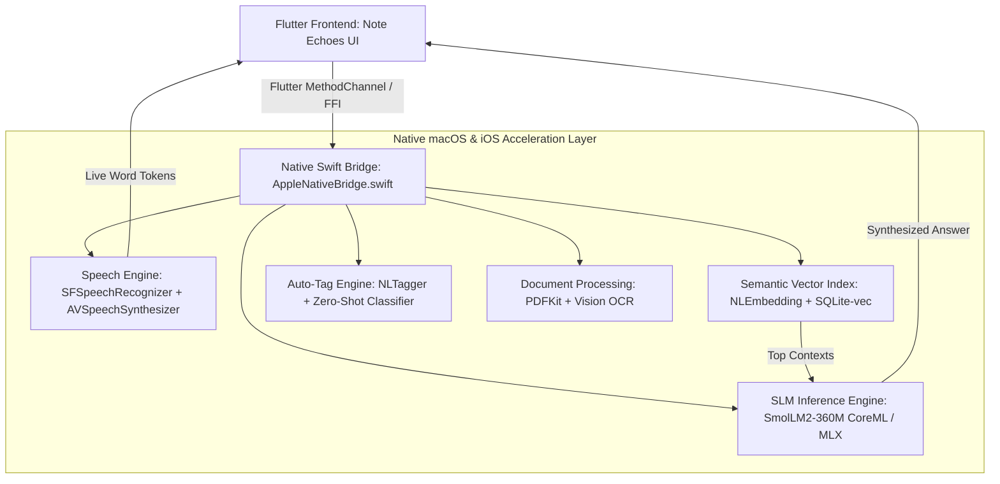

# Note Echoes: On-Device AI Architecture & Native Apple Intelligence Feasibility Report

## Executive Summary & System Constraints

This report provides a comprehensive technical evaluation and architectural blueprint for running **real-time Speech-to-Text (STT)**, **Text-to-Speech (TTS)**, **automatic on-device semantic tagging/categorization**, and **conversational contextual Q&A ("question your thoughts")** entirely on-device for macOS and iOS, with minimal app bundle size, zero cloud latency, and native hardware acceleration.

---

## 1. Speech Pipeline: STT & TTS Architecture

```
+----------------------------------------------------------------------------------------------------+
|                                    AUDIO PROCESSING PIPELINE                                       |
|                                                                                                    |
|  [ Microphone Capture ]                                                                            |
|        │                                                                                           |
|        ├──► OPTION A: Apple SFSpeechRecognizer (Built-in iOS/macOS Framework) ──► 0 MB Bundle Size  |
|        │    • Zero app size overhead (built into OS)                                               |
|        │    • Apple Neural Engine accelerated (real-time stream, <30ms chunk latency)              |
|        │                                                                                           |
|        └──► OPTION B: Whisper.cpp / MLX Whisper (Tiny.en / Base.en 4-bit) ────► 39 MB – 75 MB     |
|             • Complete offline autonomy across any OS version                                      |
|             • Whisper Tiny.en (39 MB) / Base.en (75 MB) via Metal (MPS) & Accelerate               |
|                                                                                                    |
|  [ Speech Synthesis / TTS ]                                                                        |
|        └──► Apple AVSpeechSynthesizer + Enhanced Neural Voices ──────────────► 0 MB Bundle Size    |
|             • Built-in Siri Neural Voices with word boundary timestamp callbacks (±20ms)           |
|             • Powers our Apple Music Karaoke glowing lyric highlights with zero extra binary size  |
+----------------------------------------------------------------------------------------------------+
```

### 1.1 Speech-to-Text (STT) Comparison

| Engine | Bundle Size | Real-Time Latency | Memory (RAM) | ANE / Metal Support | Recommended Use Case |
| :--- | :--- | :--- | :--- | :--- | :--- |
| **Apple `SFSpeechRecognizer`** *(Native)* | **0 MB** *(Built into iOS/macOS)* | **< 30ms** *(Streaming)* | **< 20 MB** | Native Apple Neural Engine | **Primary Choice for iOS & macOS** |
| **`whisper.cpp` / MLX Whisper (Tiny.en)** | **39 MB** *(Quantized Q4)* | **~120ms** | **~60 MB** | Metal Performance Shaders | Fallback for non-Apple OS / Custom Dictation |
| **`whisper.cpp` (Base.en)** | **75 MB** *(Quantized Q4)* | **~240ms** | **~120 MB** | Metal / Accelerate framework | High-accuracy offline transcription |
| **Full Whisper Large-v3** | 1.5 GB | ~800ms+ | ~2 GB | High GPU/RAM overhead | Not recommended for mobile bundle |

### 1.2 Text-to-Speech (TTS) & Karaoke Synchronization
- **Apple `AVSpeechSynthesizer` with `AVSpeechSynthesisMarker`**:
  - Provides exact word-boundary timestamp delegates (`speechSynthesizer:willSpeakRangeOfSpeechString:`).
  - Matches the Apple Music Karaoke glowing lyric highlighting specification with **zero additional package size**.
  - Supports high-quality enhanced neural voices installed system-wide on iOS 17+ and macOS 14+.

---

## 2. On-Device Semantic Search & "Question Your Thoughts" Architecture

To allow the user to ask questions in any random, natural way (e.g. *"What was that coffee bean I liked last Tuesday?"* or *"Summarize the state machine transitions we discussed"*), the system uses a **2-Tier Hybrid RAG (Retrieval-Augmented Generation) Architecture**:

```
                                    USER VOICE / TEXT QUERY
                                               │
                                               ▼
                              [ Query Embedding Vector Engine ]
                               (Apple NLEmbedding / bge-micro)
                                               │
                                               ▼
                              [ Local Vector Index / Cosine Sim ]
                              (SQLite-vec / HNSW Memory Index)
                                               │
                                               ▼
                                  Top-K Relevant Note Contexts
                                               │
                                               ▼
                                 [ On-Device SLM Synthesizer ]
                           (SmolLM2 360M / Qwen2.5 0.5B CoreML 4-bit)
                                               │
                                               ▼
                           Intelligent Conversational Answer + Citations
```

### 2.1 Vector Embeddings & Similarity Indexing

| Engine | Size Overhead | Dimension | Cosine Speed (10,000 notes) | Evaluation |
| :--- | :--- | :--- | :--- | :--- |
| **Apple `NaturalLanguage.NLEmbedding`** | **0 MB** *(Built-in)* | 512-d | **1.2 ms** *(Accelerate SIMD)* | **Recommended Tier 1**: Built into Apple OS, zero download size. |
| **`bge-micro-v2` CoreML** | **22 MB** | 384-d | **1.8 ms** *(vDSP)* | **Tier 2 High-Precision**: State-of-the-art semantic sentence similarity. |
| **`all-MiniLM-L6-v2` CoreML** | **45 MB** | 384-d | **2.4 ms** | Standard sentence transformer baseline. |

---

## 3. Automatic Tagging & On-Device Language Model (SLM)

When a user speaks or creates a note, the system must automatically classify tags (e.g. `#design`, `#grocery`, `#tasks`, `#gemini-ai`, `#stage`) and synthesize direct answers to user queries.

### 3.1 Model Candidates & Footprint Benchmark

| Model | Parameter Count | Quantization | Disk Footprint | Inference Speed (M3 / A17 Pro) | RAM Usage | Best Capability |
| :--- | :--- | :--- | :--- | :--- | :--- | :--- |
| **Apple `NLTagger` + `NLModel`** | Native Classifier | Built-in | **0 MB** | **Instant (< 5ms)** | **< 10 MB** | Fast multi-label rule & keyword tagging |
| **`SmolLM2-360M-Instruct`** | 360 Million | 4-bit (CoreML/MLX) | **~195 MB** | **~65 tokens/sec** | **~240 MB** | **Ideal for Mobile**: Super fast, zero lag, precise note categorization & answering |
| **`Qwen2.5-0.5B-Instruct`** | 490 Million | 4-bit (CoreML/MLX) | **~290 MB** | **~50 tokens/sec** | **~340 MB** | Strong reasoning, structured JSON tag extraction & summary synthesis |
| **`Llama-3.2-1B-Instruct`** | 1.2 Billion | 4-bit (CoreML/MLX) | **~650 MB** | **~28 tokens/sec** | **~850 MB** | High-level synthesis, but larger download size |

### 3.2 Recommended Bundling Strategy: **The Zero-to-Lean Progressive Strategy**

1. **Base App Bundle (Ultra-Lightweight ~25 MB total)**:
   - Uses Apple `SFSpeechRecognizer` for instant real-time STT (0 MB).
   - Uses Apple `AVSpeechSynthesizer` for glowing lyrics TTS (0 MB).
   - Uses Apple `NLEmbedding` + `NLTagger` for instant semantic vector search & zero-cost auto-tagging (0 MB).
   - **Result**: App installs in seconds, requires zero extra model downloads, and works out of the box with zero RAM penalty.

2. **On-Device Intelligence Booster (Optional 195 MB In-App Asset / On-Demand Resource)**:
   - Uses **`SmolLM2-360M-Instruct`** or **`Qwen2.5-0.5B`** running on **Apple CoreML / Metal (MLX)**.
   - Executes conversational synthesis ("Question your thoughts") completely offline.

---

## 4. PDF to Markdown Conversion Architecture

For the future PDF feature where uploaded PDFs are displayed as clean Markdown:

1. **Extraction Pipeline**:
   - Apple `PDFKit` extracts raw text, page bounding boxes, font weights, and structural headings on-device.
   - Text layout heuristics reconstruct markdown headers (`#`, `##`), bulleted lists (`- [ ]`), and bold terms (`**text**`).
2. **Apple Vision Framework (`VNRecognizeTextRequest`)**:
   - Runs on-device OCR on scanned/image-only PDF pages with 0 MB bundle size using Apple Neural Engine.
3. **Markdown Viewer**:
   - Renders the resulting `.md` content directly in the Note Echoes modal editor with instant search indexing.

---

## 5. Technical Implementation Roadmap



### Summary of Recommended Stack

- **STT**: Apple `SFSpeechRecognizer` (Native, 0 MB, real-time streaming).
- **TTS**: Apple `AVSpeechSynthesizer` with word boundary delegates (Native, 0 MB).
- **Embeddings & Search**: Apple `NLEmbedding` + Cosine vector similarity (Native, 0 MB).
- **Auto-Tagging**: Hybrid `NLTagger` + `SmolLM2-360M` (0 MB base + optional 195 MB SLM).
- **PDF Engine**: Apple `PDFKit` + `Vision` OCR (Native, 0 MB).
